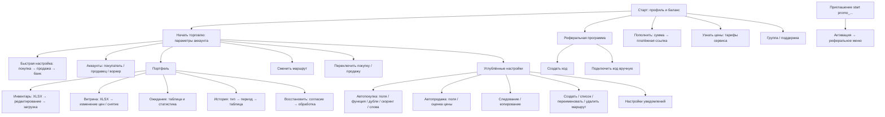

# Карта пользователя и аудит интерфейса YouTrade.CS

**Уточнение после первичного аудита:** по информации владельца, QuickConfig уже подготовлен сервером; основные повторяющиеся действия — добавление и проверка списка аккаунтов, «Ожидание» и «История продаж». Углублённые настройки почти не используются. Предложения об обязательном первичном мастере не являются текущим приоритетом. Новые контракты рефералки и добровольной оферты разобраны в [отдельной записке](referral-terms-integration.md), уточняющей прежние выводы.

Дата: 17 сентября 2026. Основа: текущие исходники
Telegram-клиента. [Индекс исходников, состояний и кнопок](repository-index.md).

**Решение после обсуждения с владельцем:** сначала сопоставить эту карту с частотой реальных действий и предложениями
владельца, затем выбрать небольшой пакет быстрых изменений. Полная переделка интерфейса не является согласованной
задачей. Приоритеты ниже предварительные.

## Границы анализа

Проиндексированы 420 Java-файлов, 107 состояний `UserMenu`, найдены 105 явных обработчиков `supportedState()`.
`ACCOUNTS_GET` и `NOTIFICATION` не имеют такого обработчика в репозитории; само по себе это не доказывает поломку
доступного сценария.

Просмотрены объявления меню, тексты и переходы пользовательских сценариев, условия видимости, уведомления, генераторы
таблиц, клиентские DTO и API для основных операций. Подробно разобраны старт, быстрая настройка, подключение аккаунтов,
портфель, продажа, оплата и рефералы. Это статический аудит, не прохождение живого бота.

Здесь нет исходников торгового сервера, фактических тарифов, аналитики конверсии и обращений пользователей. Часть
поведения сообщения и клавиатуры находится во внешней библиотеке `yttelegram-buttons`. Доступность внешних обучающих
видео и фактическое отображение на телефоне не проверялись. Иллюстрации лежат в resources; текущие основные меню
используют текстовые состояния, поэтому наличие PNG не означает, что пользователь сейчас их видит. README местами
устарел относительно структуры и pom.xml; выводы опираются на код.

Под «продажей инструмента» понимаем понятность ценности и активацию пользователя. Продажу самих предметов рассматриваем
отдельно как одну из главных рабочих задач.

## Основной вывод

Интерфейс отражает устройство системы: параметры → аккаунты → режимы → операции. Новому пользователю нужен путь к
результату: понять возможности → подключить нужное → увидеть готовность → осознанно запустить → понимать происходящее.

Хорошая основа уже есть: компактное стартовое меню, быстрые настройки, раздельные переключатели покупки и продажи,
портфель, уведомления о результатах, ссылки на страницы получения ключей, реферальный deep link. Это позволяет улучшать
отдельные участки без замены всей архитектуры.

## Рабочие гипотезы о пользователях

Это сценарии поведения для проверки, а не диагнозы и не доказанные сегменты аудитории.

| Ситуация                        | Что человек хочет                                   | Что может остановить                                                       | Что проверить в интерфейсе                                              |
|---------------------------------|-----------------------------------------------------|----------------------------------------------------------------------------|-------------------------------------------------------------------------|
| Сравнивает очередной инструмент | Быстро понять отличия, стоимость и первый результат | Общий слоган, необходимость сначала изучить настройки                      | Короткое объяснение конкретных операций и пример результата             |
| Устал, мало внимания и энергии  | Сделать одно дело и уйти                            | Много равнозначных решений, необходимость повторять ввод                   | Один следующий шаг, сохранение прогресса, исправление на месте          |
| Не хочет общаться с поддержкой  | Самостоятельно подключиться и разобраться           | Видео без краткой инструкции, неизвестная причина ошибки                   | Помощь прямо на шаге, текстовая альтернатива, понятное восстановление   |
| Уже активно торгует             | Быстро управлять текущими операциями                | Лишняя навигация, ID вместо выбора, переходы в таблицы ради одной операции | Короткие пути к частым действиям, расширенные функции остаются доступны |
| Хочет посоветовать сервис       | Отправить ссылку и понимать условия бонуса          | Создание/копирование кода, необходимость объяснять активацию               | Готовая ссылка, кнопка отправки, прозрачные условия                     |

Маркетинговая гипотеза: основной акцент — управляемость и экономия рутины. Например: «Покупка, выставление и контроль
предметов CS2 в одном Telegram-боте. Вы задаёте правила и видите состояние операций». Обещание требуется сверять с
конкретным доступным сценарием. Не использовать эмоциональное состояние человека как способ подтолкнуть его к
пополнению, обещать гарантированную доходность или стыдить за перерыв.

## Текущая карта интерфейса

### Карта пути пользователя

| Этап               | Что есть сейчас                                                             | Вопрос пользователя                               | Препятствие / возможность                                                                                           |
|--------------------|-----------------------------------------------------------------------------|---------------------------------------------------|---------------------------------------------------------------------------------------------------------------------|
| Первое знакомство  | Профиль, ID, баланс, слоган «ассистент в мире трейда»                       | Что именно сделает сервис?                        | Мало конкретики до перехода в настройки                                                                             |
| Оценка цены        | ReFill за $1000 оборота, отдельно воркер за месяц                           | За что плачу и где будут деньги?                  | «Узнать цены» можно принять за цены предметов; баланс сервиса не отделён названием от торгового капитала            |
| Начало             | «Начать торговлю» открывает «Параметры аккаунта»                            | Какой шаг первый?                                 | Нет последовательности подключения и понятного критерия готовности                                                  |
| Настройка          | Строгость покупки, строгость продажи, размер банка                          | Что изменится от моего выбора?                    | Мягкий/умеренный/строгий/тотальный не дают конкретного прогноза поведения; банк прямо описан как ориентир, не лимит |
| Подключение        | Покупатель: API + trade URL; продавец: API; воркер: логин + пароль + maFile | Зачем каждый доступ и можно ли обойтись без него? | Нужно понимать три роли; чувствительные данные требуют убедительного объяснения фактических прав и отключения       |
| Запуск             | Раздельные переключатели покупки и продажи                                  | Уже запущено? Что будет после нажатия?            | Надпись «Покупка» с цветом смешивает статус и действие; серверная причина отказа передаётся пользователю            |
| Контроль           | Портфель, объём подходящих лотов, уведомления                               | Всё работает? Почему ничего не происходит?        | Флаг включения не равен фактической готовности; нет единого объяснения блокировок                                   |
| Ручная продажа     | Инвентарь → XLSX → загрузка обратно                                         | Как выставить один предмет?                       | Выход из Telegram, редактирование файла, технические поля и предупреждения                                          |
| Изменение продажи  | Витрина → XLSX с новой вилкой или флагом снятия                             | Как поменять цену / остановить продажу?           | Для одиночной операции тот же тяжёлый путь, что для массовой                                                        |
| Оценка результата  | История покупки/продажи, период, таблица; показатели витрины и ожидания     | Сколько уже заработано?                           | Ожидаемые показатели названы «Заработок» и «Доход (чистый)»; состав комиссий и формулы здесь не видны               |
| Возвращение        | Снова текущее меню / команды                                                | Где остановился и что изменилось?                 | Локальное состояние диалога хранится в памяти; сохранение незавершённого обучения сервером не обнаружено            |
| Рекомендация другу | Создать код, подключить код, показатели                                     | Как отправить и когда начислится бонус?           | Нет готовой ссылки и отправки в реферальном меню; нет счётчика приглашённых/начислений в DTO                        |

## Наблюдения по всем разделам

| Раздел         | Что стоит сохранить                                                           | Что мешает / возможная точечная правка                                                                                                                                                                                           |
|----------------|-------------------------------------------------------------------------------|----------------------------------------------------------------------------------------------------------------------------------------------------------------------------------------------------------------------------------|
| Старт          | Всего шесть кнопок, основное действие выделено                                | Переименовать «Узнать цены» в «Стоимость сервиса»; добавить конкретику ценности                                                                                                                                                  |
| Рабочее меню   | Покупка и продажа управляются отдельно                                        | Подписать действие: «Приостановить покупки» / «Включить покупки»; явно назвать текущий маршрут                                                                                                                                   |
| QuickConfig    | Уже сокращает ручную настройку                                                | Включённая кнопка «Быстрая настройка» сразу ведёт к отключению; текст «ликвидирована» не объясняет последствий. Разделить просмотр и отключение                                                                                  |
| Аккаунты       | Страницы, роли, переименование и перенос                                      | Сначала объяснять задачу роли; заменить ручной ввод ID выбором там, где это частая операция                                                                                                                                      |
| Подключение    | Ссылки на API и trade URL, попытка удаления чувствительных входящих сообщений | `SellerAddProceedState` выводит `visible + hidden` под spoiler; фактическую маскировку ответа сервера нужно проверить. Достаточно названия подключённого аккаунта. Удаление входящего сообщения не равно удалению данных сервиса |
| Портфель       | Раздельные балансы и суммы в холде                                            | Сделать короткую сводку состояния; назвать средства сервиса и площадок по-разному                                                                                                                                                |
| Инвентарь      | Пакетная обработка через XLSX                                                 | Оставить таблицу для массовых операций; необходимость экрана одиночного предмета определить по карте частоты                                                                                                                     |
| Витрина        | Текущая цена, диапазоны, снятие с продажи                                     | 14 столбцов в экспорте; для мобильного частого действия нужен более короткий путь                                                                                                                                                |
| Восстановление | Есть отдельное согласие                                                       | «Восстановить» может означать возврат настроек, хотя речь о возможном выставлении предметов. Переименовать по результату; предпросмотр потребует сверки API                                                                      |
| История        | Выбор покупки/продажи, периода, XLSX                                          | Кнопки 7/30 дней вместо обязательного текстового ввода; компактная сводка перед таблицей                                                                                                                                         |
| Автопокупка    | Большая гибкость                                                              | Пользователь вводит имя поля; линейная/экспоненциальная функции, Words, Scoring требуют знаний. Не выводить в первый запуск                                                                                                      |
| Автопродажа    | Настраиваемая прибыльность и оценка цены                                      | EvalMode/EvalModeS1/evalModeC1 — названия реализации. Переименование возможно после выяснения точного смысла на сервере                                                                                                          |
| Скоринг        | Есть объяснение трёх типов                                                    | Запрос «минимальной рентабельности (больше 90)» легко прочитать как 90% прибыли; уточнить формулу и пример с сервером                                                                                                            |
| Словари        | Есть включение/исключение и массовый ввод                                     | При добавлении текст всегда просит «исключаемые слова», даже для режима включения                                                                                                                                                |
| Следование     | Копирование и синхронизация, согласие другого пользователя                    | ID и заявки увеличивают зависимость от других людей. Оставить как дополнительную функцию; показать, что именно будет синхронизироваться                                                                                          |
| Маршруты       | Создание направления, список, переименование, удаление                        | «Параметры», «маршрут», params-ID обозначают одну рабочую сущность разными словами                                                                                                                                               |
| Удобство       | Есть выбор подробности сообщений торгов                                       | Подписи зелёная/красная выглядят как вкл/выкл, хотя экран говорит «Полные/Короткие»                                                                                                                                              |
| Оплата         | Сумма, оператор, срок ссылки, уведомление о результате                        | Нет объяснения назначения баланса на первом шаге; ошибка числа возвращает в старт                                                                                                                                                |
| Рефералы       | Код, бонусы, deep link уже поддерживаются                                     | Готовая ссылка и отправка — небольшой независимый кандидат на улучшение                                                                                                                                                          |
| Уведомления    | События покупки, продажи, отмены и обработки                                  | Неудачный торг содержит «Куплено за»; подробные сообщения перегружены. Сначала исправить смысл, затем обсуждать частоту                                                                                                          |
| Ошибки         | Общий способ вернуться через /start                                           | Технические номера, сброс шага и неверные переходы делают исправление дорогим                                                                                                                                                    |

## Конкретные дефекты для отдельного короткого списка

Это выводы из исходников, без воспроизведения в живом боте. Пути к классам находятся в индексе.

1. **Изменение только флага запрета в XLSX инвентаря пропускается.** `TableV2InventoryGenerator.handleFile()`
   подставляет `0` в пустые ценовые поля и пропускает строку при равенстве трёх цен до чтения флага. При нетронутых
   ценах изменение одного «Запретить» не попадёт в DTO. То же условие пропускает строку с тремя одинаковыми ценовыми
   строками. Это точный локальный кандидат на исправление и небольшой тест парсера.
2. **Неверные возвраты при ошибках:** `AutoSellUpdateFieldState` → SCORING при неизвестном поле; `UnfollowIdState` →
   WORDS/SCORING; `RefConnectCodeState` → SCORING при отсутствии сообщения. Пользователь оказывается в посторонней
   задаче.
3. **Ошибки подписи:** `WordsAddKeyWordState` всегда пишет «исключаемые»; пустые списки в `ParamsSwitchIdState` и
   `ParamsRenameIdState` названы scoring-ID.
4. **Неудачный торг:** `YTBargainFailedNotifier` использует текст «Куплено за» для неудачного события.
5. **HTML заявок следования:** в `UserFollowCheckState` встречается открывающий `<b>` вместо закрывающего. Возможное
   отклонение сообщения Telegram нужно проверить отдельно.
6. **Ошибки обычного ввода сбрасывают сценарий.** Например, `ConfigCreateBankSizeState` и `UserPayAmountState` после
   неверного числа возвращают START. Запятая в дробном числе не принимается `Double.parseDouble`.
7. **Проверить маскировку ответа подключения продавца.** `SellerAddProceedState` отображает конкатенацию серверных
   `visible + hidden` под spoiler как подключённый ключ. По этому клиенту нельзя установить, присылает ли сервер полный
   ключ или уже маскированную строку. Достаточно названия аккаунта; spoiler сам по себе не является маскировкой данных.

Сначала выбрать дефекты, затрагивающие частые действия. Исправления пока не выполнялись.

## Удобная реферальная программа без большой переделки

Сейчас `TelegramUpdReceiverService` распознаёт `/start promo_<code>` и ведёт на активацию. `RefEndpoint` уже имеет
get/create/connect. Поэтому основа первого этапа существует.

**Кандидат на быстрый пакет в боте:**

- Показывать готовую ссылку `https://t.me/<bot_username>?start=promo_<code>` рядом с условиями.
- Сделать кнопку «Пригласить друга», открывающую отправку ссылки с коротким редактируемым текстом. Отправку адресату
  совершает сам пользователь.
- При отсутствии кода — «Получить ссылку»; после создания сразу показывать результат, а не заставлять заново искать
  меню.
- «Подключить» переименовать в «Ввести код друга».
- После успешной активации дать понятный следующий шаг к настройке торговли. При невалидном коде сохранить доступ к
  обычному старту.
- Писать, кто получает бонус, от какой суммы считается процент и когда начисляется — только по подтверждённым серверным
  правилам.

Deep linking предусмотрен Telegram; параметр имеет ограничение длины и допустимых символов. Нужно проверить реальные
коды и username бота. [Telegram Bot Features](https://core.telegram.org/bots/features#deep-linking).

**Отдельно, при необходимости сервера:** число приглашённых и активированных, журнал начислений, доступный/ожидающий
бонус, правила повторной активации и самоприглашения. Поля `FcdRefDto` сейчас ограничены turnover, discount, thisRef,
usedRef, refRate, refReward. Нельзя выдавать `refReward` за уже заработанную сумму без подтверждения семантики.

## Обучение и сервер: только необходимые добавления

Большое обязательное видео не решает все затруднения. Предлагаемый формат для обсуждения — короткая текстовая инструкция
непосредственно на нужном шаге, необязательное видео и понятная кнопка продолжения. Ясные инструкции, предсказуемые шаги
и помощь в исправлении ошибок соответствуют рекомендациям W3C по когнитивной доступности; это общий принцип удобства, а
не медицинский вывод об
аудитории. [W3C: Clear and Understandable Content](https://www.w3.org/WAI/WCAG2/supplemental/objectives/o3-clear-content/), [W3C: Supplemental Guidance](https://www.w3.org/WAI/WCAG2/supplemental/).

Для текстов и ссылок рядом с существующими шагами новый серверный API может не потребоваться. Если нужен сохраняемый
мастер, полезен минимальный контракт:

| Возможность                         | Что требуется выяснить / получить от сервера                                                                                       |
|-------------------------------------|------------------------------------------------------------------------------------------------------------------------------------|
| Продолжить настройку после перерыва | Версия сценария, завершённые шаги, текущий шаг; готовность вычислять из актуальных аккаунтов                                       |
| Показать «готов к запуску»          | Состояния подключений, необходимые роли для выбранного сценария, причины блокировки, время проверки                                |
| Понятно включить/выключить          | Сейчас используются toggle-вызовы; явная установка состояния и защита от повторного выполнения надёжнее для повторных нажатий      |
| Объяснить цену                      | Актуальные тарифы и правила списания, отдельно сервис и площадки                                                                   |
| Ограничить пробный запуск           | Реальный исполняемый лимит, если продукт решит его предлагать. `preferredTradeCapital` нельзя назвать лимитом только сменой текста |
| Одиночная операция с предметом      | Проверить пригодность текущих inventory/selling DTO; предпросмотр, актуальность цены и результат операции                          |
| Реферальная статистика              | Определения событий и начислений, затем дополнительные поля                                                                        |

Не обязательно реализовывать всё перечисленное. Выбирать контракт только под согласованный частый сценарий.

## Как выбрать быстрые меры

До получения пользовательской карты порядок условный:

| Пакет                                   | Предполагаемый объём          | Зависимости                                             | Что измерять                                            |
|-----------------------------------------|-------------------------------|---------------------------------------------------------|---------------------------------------------------------|
| Точность текстов и возвратов            | Небольшие изменения клиента   | Подтвердить смысл отдельных финансовых терминов         | Повторные ошибки, обращения, завершение сценария        |
| Реферальная ссылка и отправка           | Ограниченный сценарий клиента | Username, формат кодов, правила бонусов                 | Создание ссылки → активация кода → начало использования |
| Короткий путь к одному частому действию | Определяется картой владельца | Возможно текущих API достаточно                         | Успешное выполнение, число шагов, время                 |
| Обучение на одном проблемном шаге       | Текст/видео + переход         | Сервер нужен только для дополнительных данных/прогресса | Завершение шага без поддержки                           |
| Сохраняемый первый запуск               | Более крупная задача          | Серверная готовность и прогресс                         | Первое подключение → готовность → запуск                |

Не обещать «кратный рост» до измерения. Для сравнения нужны исходные показатели: доля завершивших выбранный сценарий,
время выполнения, ошибки и обращения. Для онбординга отдельно считать готовность и первый запуск, не только денежные
сделки. Сбор событий не должен включать API-ключи, пароли, maFile или свободный текст с такими данными.

От владельца достаточно карты в свободной форме: **действие → как часто → где мешает → желаемое изменение**.
Дополнительно полезно указать, кто это делает — новичок или постоянный трейдер, с телефона или компьютера. После этого
выбирать 3–5 точечных изменений; остальное оставить в резерве.
